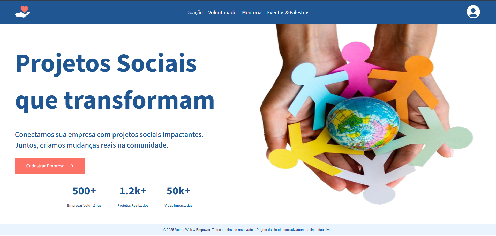

<p align="center">
  
</p>


# 🌍 Conecta Jovem — Projetos Sociais

Plataforma web criada para conectar empresas, voluntários e projetos sociais, promovendo impacto positivo na comunidade por meio de doações, voluntariado, mentorias e eventos.

---

## 🚀 Funcionalidades

- Listagem de projetos sociais
- Área de doações
- Voluntariado
- Mentorias
- Eventos e palestras
- Layout responsivo
- Navegação fluida

---

## 🛠️ Tecnologias Utilizadas

- React
- Vite
- Sass (SCSS)
- React Router DOM
- React Icons
- Google Fonts
- CSS Modules
- JavaScript (ES6+)

---

## 📁 Estrutura do Projeto

```bash
src/
├── assets/
├── components/
│   └── layout/
├── pages/
├── routes/
├── styles/
├── data/
├── App.jsx
└── main.jsx
# CONNECT
